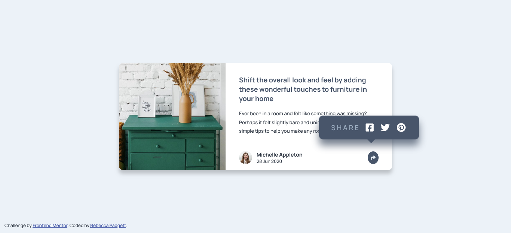

# Frontend Mentor - Article preview component solution

This is a solution to the [Article preview component challenge on Frontend Mentor](https://www.frontendmentor.io/challenges/article-preview-component-dYBN_pYFT). Frontend Mentor challenges help you improve your coding skills by building realistic projects.

## Table of contents

- [Overview](#overview)
  - [The challenge](#the-challenge)
  - [Screenshot](#screenshot)
  - [Links](#links)
- [My process](#my-process)
  - [Built with](#built-with)
  - [Useful resources](#useful-resources)
- [Author](#author)
- [Acknowledgments](#acknowledgments)

## Overview

### The challenge

Users should be able to:

- View the optimal layout for the component depending on their device's screen size
- See the social media share links when they click the share icon

### Screenshot

### Links

- Solution URL: [Frontend Mentor](https://www.frontendmentor.io/solutions/article-preview-component-using-html-css-and-javascript-ZQkE6nZG5x)
- Live Site URL: [Github Pages](https://bccpadge.github.io/article-preview-component/)

## My process

### Built with

### Useful resources

- [HTML meta tag](https://www.w3schools.com/tags/tag_meta.asp) - I added more metadata in head tag for beter SEO.
- [Aria-haspopup attribute](https://developer.mozilla.org/en-US/docs/Web/Accessibility/ARIA/Attributes/aria-haspopup) - I placed aria-haspopup attribute on the share button.
- [Font awesome cdn](https://cdnjs.com/libraries/font-awesome) - CDN link for font awesome icons
- [Triangle down shape](https://www.w3schools.com/howto/howto_css_shapes.asp) - The starting code to create the little traingle on the tooltip.
- [Closest() method](https://www.w3schools.com/jsref/met_element_closest.asp) - I used the closest() method in JavaScript to match the CSS selector when you want close the tooltip.
- [Coolors Color Contrast Checker](https://coolors.co/contrast-checker/112a46-acc8e5) - The desaturated dark blue has low contrast and switched the color to `color: hsl(216, 17%, 23%);`

## Author

## Acknowledgments

- [little traingle ](https://www.youtube.com/watch?v=ks_LoMY72Ps) - The rest of the little traingle down code is in the Youtube comment section of this video.
- [Article preview component solution](https://www.frontendmentor.io/solutions/accessible-and-responsive-article-preview-component-using-scss-and-js-JtU9VwdSSx) - I referenced this amazing solution to implement accessbility with the share button and the JavaScript code.
